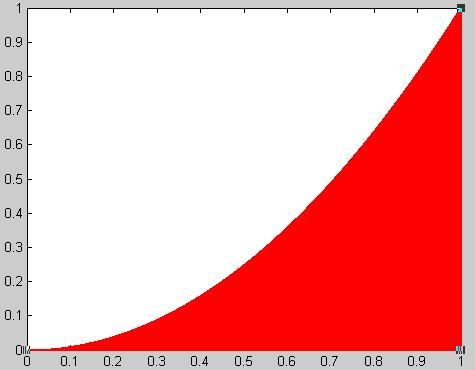

# Monte Carlo and quasi-Monte Carlo 

## Monte Carlo method Intro

Monte Carlo methods(experiments) are a broad class of computational algorithms that rely on repeated random sampling to obtain numerical results. Their essential idea is using randomness to solve problems that might be deterministic in principle.
They are often used in physical and mathematical problems> Monte Carlo methods are mainly used in three problem classed:optimization,numerical integration, and genrating draws from a probability distribution.

它的理论基础是大数定律,样本数量越多其平均值就越趋近于真实值

### [阮一峰-蒙特卡罗方法入门](http://www.ruanyifeng.com/blog/2015/07/monte-carlo-method.html)
### [acdreamer-蒙特卡洛算法(代码实现](https://blog.csdn.net/acdreamers/article/details/44978591)
### [stanford-MC](http://statweb.stanford.edu/~owen/pubtalks/MCQMC2012-Owen-Tutorial.pdf)
### [stanford-QMC](http://statweb.stanford.edu/~owen/pubtalks/qmctutorial-annotated.pdf)
蒙特卡洛方法作为一种计算方法,通过大量随机样本,去了解一个系统,进而得到所要计算的值;它名字高大上,却往往是最简单的方法

### 例子1:计算圆周率
正方形内部有一个相切的圆,在这个正方形内部,随机产生10000个`pair<int,int>`,计算他们与中心点的距离,并判断是否落在圆的内部...

$$  \pi\approx4\frac{ dotsIn CircleNum }{ all Dots Num }  $$

```c++
#include<bits/stdc++.h>
// #define fori(x) for(int i=0;i<(x);i++)
using namespace std;

int main(){
    srand(time(NULL));
    int cnt=0;
    fori(MAX_ITERS){
        double x = 2*rand()*1.0/RAND_MAX - 1;
        double y = 2*rand()*1.0/RAND_MAX - 1;
        if(x*x + y*y <=1)
            cnt++;
    }
    cout<<cnt*4.0/MAX_ITERS;
}
```
把上面的方法推广,计算$\int_0^1{x^2dx}$,
就可以在正方形内产生大量随机点,可以计算出有多少点落在红色区域内

```py
import random
cnt = 0
for i in range(MAX_ITERS):
    if random.random()**2>random.random():
        cnt+=1

print(cnt/MAX_ITERS)
```

### 例子2

>以上机实验一为例,[我](https://github.com/Haozun/ball_in_box/blob/master/ball_in_box/ballinbox_obsolete.py)的方法,原来就是这样的思想


## Quasi-Monte Carlo method intro(QMC)

In numerical analysis(associate with numerical integration), the quasi-Monte carlo method is a method for numerical integration and solving some other problems using lowdiscrepancy sequences.

### tutorial 

The problem is to approximate the integral of a funciton $f$ as the average of the function evaluated at a set of points $x_1,...,x_N$:

$$ \int_{[0,1]^8}f(u)du\approx \frac{1}{N}\sum _{i=1}^{N}f(x_{i}) $$

蒙特卡洛方法与拟蒙特卡罗方法的不同之处在于$x_i$的选择上,拟.. 用*low-discrepancy sequence* such as *The Halton sequence*,*the Sobol sequence* ... 
而蒙特卡洛用 pseudorandom sequence (其实电脑产生的随机数一般都是伪随机,与*truly random*相对,*quasi random*也和这个概念相对)

两大类序列的重要区别是,前者的 *Approximation error* 收敛的更快$O(\frac{1}{N})$,后者只有$O(N^{-0.5})$

$$ \varepsilon = \left| 
    \int_{[0,1]^8}f(u)du 
    - 
    \frac{1}{N}\sum _{i=1}^{N}f(x_{i}) 
\right| $$

...
知识部分到此为止,不详述,参见我的博客文章